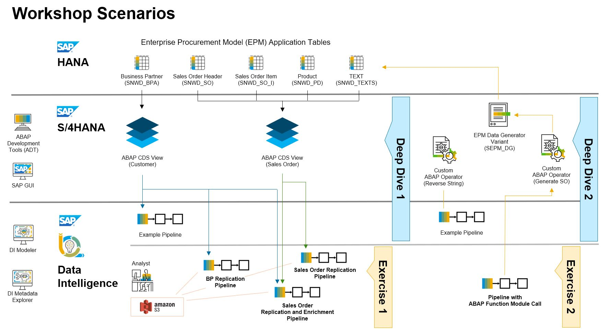

# Integrating SAP S/4HANA into SAP Data Intelligence: Deep Dive and Hands On

## Description

This repository contains the material for the SAP training session called 
**Integrating SAP S/4HANA into SAP Data Intelligence: Deep Dive and Hands On**.

## Overview

SAP Data Intelligence is SAP's leading product for data integration, data management, intelligent processing and orchestration across different (hybrid) data environments.
One important integration aspect is the replication, consumption, and exchange of data and functionality with SAP's core Intelligent Enterprise and Business Suite systems. The ABAP integration capabilities in SAP Data Intelligence open seamless, "any-premise" interoperability with almost all the features available in these environments. 

This hands-on session will focus on connectivity and system interoperability to SAP S/4HANA systems and provides an insight on how to use the corresponding out-of-the-box operators in SAP Data Intelligence to smoothly integrate with the above SAP Business applications and beyond.

## Requirements

The requirements to follow the exercises in this repository are:
- Basic knowhow about the usage and scope of S/4HANA 
- General understanding of Enterprise Data Management and ETL (Extraction, Transformation, Load)
- Basic programming skills in ABAP are of advantage
- Locally installed Eclipse IDE with ABAP Development Tools (ADT) and training S/4HANA resource connected
- Locally installed SAP Logon App and SAP GUI

## Deep Dive Demos and Hands-On Exercises

<!--
Provide the exercise content here directly in README.md using [markdown](https://guides.github.com/features/mastering-markdown/) and linking to the specific exercise pages, below is an example.
-->

The main use cases behind this workshop are
- The extraction the Business Partner master data in S/4HANA's demo application **Enterprise Procurement Model (EPM)** and making the records available for the corporate Data Analysts in an S3 object store.
- Also persist the transactional data in S3, i.e for EPM Sales Order objects which are built from joins over multiple EPM tables.
- In both cases, any single change of these data sources in the S/4HANA system has to be instantly and automatically replicated to the related files in S3.
- Additionally, the Sales Order data have to be enriched with Customer master data, for the initial load and then on every change committed to the EPM Sales Order data in S/4HANA.
- In order to create test changes on the EPM Sales Order data without accessing the SAP GUI in the S/4HANA system, (a variant of) the EPM Data Generator reports can be executed as an ABAP Function Modul call from a Data Intelligence Pipeline.  

### Agenda

- **[Overview and Getting Started](exercises/ex0/)**
     - [Short introduction to the Enterprise Procurement Model (EPM) in ABAP systems](exercises/ex0#short-introduction-to-the-enterprise-procurement-model-epm-in-sap-s4hana)
     - [Introduction to the workshop scenarios (Demos and Exercises)](exercises/ex0#short-introduction-to-the-enterprise-procurement-model-epm-in-sap-s4hana)
     - [Access to the Data Intelligence and S/4HANA environments](exercises/ex0#access-to-the-exercises-data-intelligence-environment)

- **Demo 1 - ABAP CDS View based data extraction in SAP Data Intelligence**
    - Demo 1.1 - Creating ABAP CDS Views in ABAP Develoment Tools (ADT)
    - Demo 1.2 - Delta-enablement for simple and complex ABAP CDS Views
    - Demo 1.3 - Integrate ABAP CDS Views in SAP Data Intelligence Pipelines

- **Demo 2 - Calling an ABAP function module in SAP S/4HANA from SAP Data Intelligence**
    - Demo 2.1 - Create a custom ABAP Operator in SAP S/4HANA
    - Demo 2.2 - Integrate the custom ABAP Operator in a SAP Data Intelligence Pipeline
    
- **[Exercise 1 - Replicating data from S/4HANA ABAP CDS Views in SAP Data Intelligence](exercises/ex1/)**
    - [Exercise 1.1 - Create a simple ABAP CDS View in ABAP Develoment Tools (ADT)](exercises/dd1#deep-dive-11---create-a-simple-abap-cds-view-in-adt)
    - [Exercise 1.2 - Delta-enablement for simple ABAP CDS Views](exercises/dd1#deep-dive-12---delta-enablement-for-simple-abap-cds-views)
    - [Exercise 1.3 - Create a more complex ABAP CDS View in ADT (joining multiple tables)](exercises/dd1#deep-dive-13---create-a-more-complex-abap-cds-view-in-adt-joining-multiple-tables)
    - [Exercise 1.4 - Delta-enablement for a complex ABAP CDS Views (joining multiple tables)](exercises/dd1#deep-dive-14---delta-enablement-for-complex-abap-cds-views-joining-multiple-tables)
    - [Exercise 1.5 - Consume the EPM Business Partner ABAP CDS Views in SAP Data Intelligence](exercises/ex1#exercise-11---consume-the-epm-business-partner-abap-cds-views-in-sap-data-intelligence)
    - [Exercise 1.5 - Extend the Pipeline to transfer Customer data to an S3 Object Store (Initial Load and Delta Load)](exercises/ex1#exercise-12---extend-the-pipeline-to-transfer-the-customer-data-into-an-s3-object-store-with-initial-load-and-delta-load-modes)
    - [Exercise 1.6 - Implement a Pipeline for replication of enhanced EPM Sales Order data to an S3 Object Store](exercises/ex1#exercise-13---implement-a-pipeline-for-delta-transfer-of-enhanced-epm-sales-order-data-from-s4hana-to-an-s3-object-store)
    - [Exercise 1.7 - Extend the Pipeline for joining Sales Order with Customer data for each change in Sales Orders and persist results in S3](exercises/ex1#exercise-14---extend-the-pipeline-for-joining-sales-order-with-customer-data-for-each-change-in-sales-orders-and-persist-results-in-s3)
    
- **[Exercise 2 - Creating a Custom ABAP Operator in a remote S/4HANA system and triggering the execution of a function module call in SAP Data Intelligence](exercises/ex2/)**
    - [Exercise 2.1 - Making custom ABAP Operators available in SAP Data Intelligence](exercises/ex2#exercise-21---making-custom-abap-operators-available-in-sap-data-intelligence)
    - [Exercise 2.2 - Using a custom ABAP Operator to verify your Delta Replication of EPM Sales Orders](exercises/ex2#exercise-22---using-a-custom-abap-operator-to-verify-your-delta-replication-of-epm-sales-orders)

 Here is a graphical overview about the topics and processes that we will focus on during this hands-on workshop and how they relate to each other.  
  

## How to obtain support

Support for the content in this repository is available during the actual time of the online session for which this content has been designed. Otherwise, you may request support via the [Issues](../../issues) tab. 

In case you have problems with the implementation of the Pipelines, you can download the example Pipelines here (right-click --> save link as...). The JSON files can be imported as Pipelines in the Data Intelligence Modeler.
- [Customer Master Data Replication Pipeline](https://github.com/BM285/DI_ABAP_Integration/blob/main/pipelines/teched.TA99.EPM_Customer_Replication_to_S3.json)
- [Sales Order Replication Pipeline](https://github.com/BM285/DI_ABAP_Integration/blob/main/pipelines/teched.TA99.EPM_SalesOrder_Replication_to_S3.json)
- [Sales Order Replication and Enrichment Pipeline](https://github.com/BM285/DI_ABAP_Integration/blob/main/pipelines/teched.TA99.EPM_SalesOrder_Replication_Enrich_to_S3.json)
- [ABAP Function Module Call Pipeline](https://github.com/BM285/DI_ABAP_Integration/blob/main/pipelines/teched.TA99.EPM_FM_Call_SO_Generator.json)

## License
Copyright (c) 2020 SAP SE or an SAP affiliate company. All rights reserved. This project is licensed under the Apache Software License, version 2.0 except as noted otherwise in the [LICENSE](LICENSES/Apache-2.0.txt) file.
