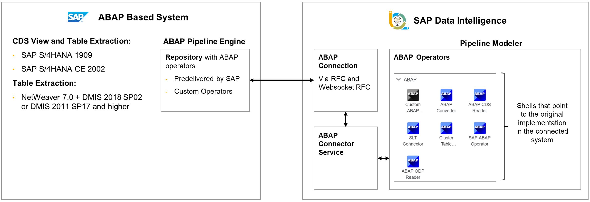

# Deep Dive 2 - Calling an ABAP function module in SAP S/4HANA from SAP Data Intelligence

In this Deep Dive, we will demonstrate how to create a custom ABAP operator in SAP S/4HANA and trigger its execution from a Pipeline in SAP Data Intelligence. The ABAP operators are developed in the S/4HANA system as normal development objects, hence, they can be transported within the system landscape.<br>

The basis for the integration with SAP Data Intelligence are the ABAP Pipeline Engine in SAP S/4HANA and the ABAP Subengine in SAP Data Intelligence, both linked with either an RFC or a Websocket RFC connection.

After a new ABAP Operator has been created, it can be used immediately in the SAP Data Intelligence Modeler by leveraging its dynamic ABAP Integration operator. These operators in SAP Data Intelligence are actually shells that point to the original implementation in the connected S/4HANA system.

There are two variants of this operator type available in Data Intelligence:
1. SAP ABAP Operator: This can be used with any ABAP operator delivered by SAP (in namespace `com.sap`). Examples for out-of-the-box operators are (the already known) ABAP CDS Reader, ODP Reader, SLT Connector, Cluster Table Splitter (for Business Suite systems), and the ABAP Converter. 
2. Custom ABAP Operator: This can be used with any ABAP operator created by customers (in namespace `customer.<xyz>`).<br>



In order to use the ABAP Subengine, the following prerequisites have to be met:
1. A supported ABAP system is available (see table below)
2. The ABAP system can be reached via RFC or WebSocket RFC (HTTPS is still supported but will get deprecated soon)
3. A user with the necessary authorizations (see SAP Note [2855052](https://launchpad.support.sap.com/#/notes/2855052))
4. An RFC or Websocket RFC connection has been created in the Connection Manager
5. Whitelisting of operators and data objects (tables, views, etc.) in the S/4HANA system (see SAP Note [2831756](https://launchpad.support.sap.com/#/notes/2831756)).

The ABAP Pipeline Engine is supported starting from the following releases (you can also run this scenario with a SAP Business Suite system, but then it is required to install the (non-modifying) DMIS add-on on that system.)<br>
ABAP Edition | Minimum version | Recommended Version
------------ | --------------- | -------------------
S/4HANA on Premise | OP1909 + Note 2873666 |
S/4HANA Cloud | CE2002 | 
Netweaver < 7.52 (ECC, BW, SRM, ...) | Add-On DMIS 2011 SP17 + Note 2857333 or 2857334 | Add-On DMIS 2011 SP18
Netweaver >= 7.52 (ECC, BW, SRM, ...) | Add-On DMIS 2018 SP02 + Note 2845347 | Add-On DMIS 2018 SP03
> **Note:**
> Please also consult the most up-to-date Availability Matrix.

<br>ABAP Operators are created in the ABAP System by implementing the BAdI: `BADI_DHAPE_ENGINE_OPERATOR`.<br>
The BAdI implementation consists of a class with **two methods** that must be redefined. It is recommended that the BAdI implementation extends the abstract class
`cl_dhape_graph_oper_abstract`.
- GET_INFO: Returns metadata about the operator
- NEW_PROCESS (with its local class `lcl_process`): Creates a new instance of the operator.

`lcl_process` uses a simple event-based model and can be implemented by redefining one or more of the following methods:
- ON_START: Called once, before the graph is started
- ON_RESUME: Called at least once, before the graph is started or resumed
- STEP: Called frequently (loop)
- ON_SUSPEND: Called at least once, after the graph is stopped or suspended
- ON_STOP: Called once, after the graph is stopped

## Deep Dive 2.1 - Create a custom ABAP Operator in SAP S/4HANA

Like the CDS Views, custom ABAP Operators could also be manually implemented in S/4HANA (Class Builder) or in the ABAP Development Tools (ADT) on Eclipse.<br>
However, in order to reduce manual activities to a minimum, there is a framework available that supports you in the creation of all artifacts in the S/4HANA ABAP backend that are required for your own ABAP operator. That framework consists of two reports that must be executed in sequence:
- `DHAPE_CREATE_OPERATOR_CLASS`: Generate an implementation class
- `DHAPE_CREATE_OPER_BADI_IMPL`: Create and configure a BAdIimplementation

After running these two reports, the generated implementation class can be adapted as needed.<br>
Here is a step-by-step guideline for creating a custom ABAP Operator. In the specific use case below, the ABAP Operator in S/4HANA should receive a string from a Pipeline ABAP Operator in Data Intelligence, reverses the string, and sends it back to the Pipeline ABAP Operator in Data Intelligence.

1. Click here.


2.	Insert this line of code.
```abap
response->set_text( |Hello World! | ). 
```


## Deep Dive 2.2 - Integrate the custom ABAP Operator in a SAP Data Intelligence Pipeline

After completing these steps you will have...

1.	Enter this code.
```abap
DATA(lt_params) = request->get_form_fields(  ).
READ TABLE lt_params REFERENCE INTO DATA(lr_params) WITH KEY name = 'cmd'.
  IF sy-subrc <> 0.
    response->set_status( i_code = 400
                     i_reason = 'Bad request').
    RETURN.
  ENDIF.

```

2.	Click here.


## Summary

You've now ...

Continue to - [Exercise 2 - Exercise 2 Description](../ex2/README.md)


