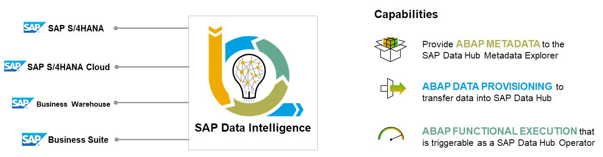
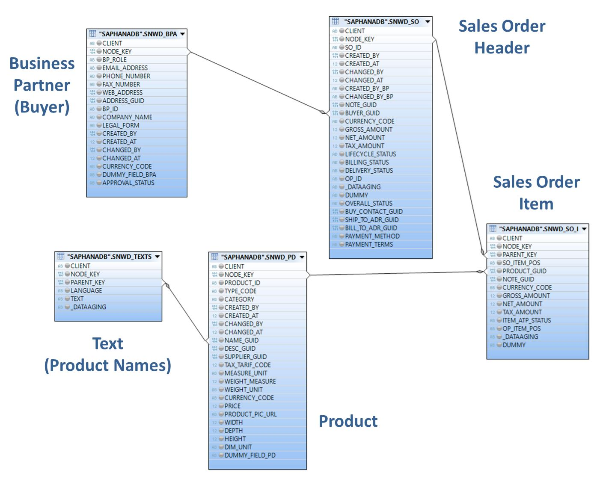
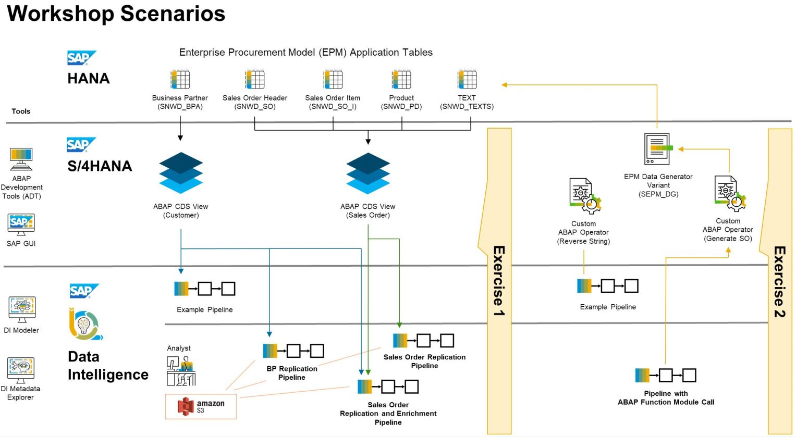

# Overview and Getting Started

The idea of ABAP Integration is to establish a unified model to consolidate all interaction scenarios between SAP Data Intelligence and an ABAP-based SAP system (directional and bi-directional).

The primary use cases for ABAP integration in SAP Data Intelligence are metadata retrieval, data provisioning, and functional execution.

 This Deep Dive and Hands-On Session concentrates on the uses cases of **ABAP Data Provisioning** and **ABAP Functional Execution**. 

**1. ABAP Data Provisioning** 
Getting access to and using real business data in an SAP Data Intelligence pipeline helps you to build new intelligent applications and data flows. 
For example, you may want to obtain the replication data from an SAP S/4HANA system, enrich the data in an SAP Data Intelligence pipeline, and then feed it to a target storage in the cloud. 
The ABAP data provisioning gives you access to SAP S/4HANA and allows you to consume ABAP CDS views directly in a pipeline. ABAP CDS is the semantically rich data model in SAP S/4 HANA and allows the consistent representation of a business object (such as a business partner). It is feasible to just get this data in an initial load, but also to have a stream approach established to consume every update, insert, and delete that happens in the SAP S/4HANA system. For details about what options you have with the different release levels and release combinations, see [SAP Note 2830276](https://launchpad.support.sap.com/#%2Fnotes%2F2830276).

**2. ABAP Functional Execution** 
In certain scenarios, it is required to enhance the scope of a data-driven application by accessing and writing data into an SAP S/4HANA system. For example, it may be necessary to execute a function module or BAPI within a pipeline to read data into SAP Data Intelligence, post information into an ABAP-based SAP system, or trigger an execution in the remote system. If you require this type, you can create your own operator in SAP Data Intelligence that references the corresponding ABAP functionality. You can find a list of all available operators in the ABAP section of the [Repository Object Reference for SAP Data Intelligence](https://help.sap.com/doc/d131eca2150049da86c541ee0895177c/Cloud/en-US/cloud_loiod131eca2150049da86c541ee0895177c.pdf).

## Short introduction to the Enterprise Procurement Model (EPM) in SAP S/4HANA

In this workshop we will be using the Enterprise Procurement Model (EPM) as a data basis for our Deep Dive and Exercise scenarios. It is provided in all ABAP systems, hence also in SAP S/4HANA, as a ready-to-go demo application. 

The business scenario at the core of EPM is that of a web shop run by a retail company called ITelO, a fictitious company that buys and sells computers & accessories. ITelO is a global player with several subsidiaries and locations world-wide selling its products through direct distribution channels. The company has various reseller and standard customers as well as various suppliers. Customers can purchase goods either directly from ITelO or indirectly from a supplier if the goods are not on stock. 
The main entities supporting the business scenario in EPM are implemented as Business Objects (BO). An example of an EPM BO is the Product BO, which encapsulates the business logic for maintaining and browsing products. The business objects available in EPM support the sales and procurement processes. 

In order to support a realistic scenario, there are means to generate mass data which allow the simulation of real-world data volumes for business entities such as purchase orders and master data such as products. The generated data is approved and can be used at customers’ sites. EPM data can be generated in SAP S/4HANA via transaction **ESPM_DG**.

Even though EPM also provides several BO specific CDS Views, which are all linked to each other via associations, we'll be using the underlying physical tables in our Deep Dive demos and the Exercises. They are starting with the prefix `SNWD_`.

The relevant tables for our scenario are
- BUSINESS PARTNER (`SNWD_BPA`),
- SALES ORDER HEADER (`SNWD_SO`),
- SALES ORDER ITEM (`SNWD_SO_I`),
- PRODUCT (`SNWD_PD`),
- and TEXTS (`SNWD_TEXTS`).

Here is how these tables relate to each other: 
  

## Exercise scenarios

The main use cases behind this workshop are
- The extraction the Business Partner master data in S/4HANA's demo application **Enterprise Procurement Model (EPM)** and making the records available for the corporate Data Analysts in an S3 object store.
- Then also persist the transactional data in S3, i.e for EPM Sales Order objects which are built from joins over multiple EPM tables.
- In both cases, any single change of these data sources in the S/4HANA system has to be instantly and automatically replicated to the related files in S3.
- Additionally, the Sales Order data have to be enriched with Customer master data, for the initial load and then on every change committed to the EPM Sales Order data in S/4HANA.
- In order to create test changes on the EPM Sales Order data without accessing the SAP GUI in the S/4HANA system, (a variant of) the EPM Data Generator reports can be executed as an ABAP Function Modul call from a Data Intelligence Pipeline. 

Here is a graphical overview about the topics and processes that we will focus on during this hands-on workshop and how they relate to each other.  
  

## Access to the exercises' Data Intelligence environment

All participants should have received an Excel spreadsheet with a mapping of the SAP User to the Workshop user and the related credentials for the S/4HANA and Data Intelligence system. 

The Eclipse based **ABAP Development Tools (ADT)** can be setup as follows
- Add an entry for an user specific application server to your list of connections in the SAP Logon application. 
Use the following settings:
   - Description:        Training S/4HANA Integration with Data Intelligence (example)
   - System ID:	     S4H
   - Instance Number:	00
   - Application Server: 18.158.247.81
- Initially log on to the S/4HANA system and change your password, when prompted. Remember the password for later usage.
- In ADT, add a new ABAP Project and select the above System Connection and logon to Client 000 with your renewed S/4HANA credentials.
 

You can log on as follows to the **SAP Data Intelligence (DI)** system
- In a Chrome Browser, open the link to: https://vsystem.ingress.dh-3s98cuwz0.dh-canary.shoot.live.k8s-hana.ondemand.com/app/datahub-app-launchpad
- Logon to tenant *workshop* and use the credentials of the Excel user mapping list that you have received along with the workshop invitation.
- The SAP Data Intelligence environment that is assigned to this hands-on workshop already contains a Connection of type RFC to the backend SAP S/4HANA system set up (see also in DI Connection Management). In the Pipelines that you create in SAP Data Intelligence, you can leverage this existing RFC Connection and integrate the CDS Views and custom ABAP Operators that were implemented during the Exerrcise parts of the workshop.  

## Next Step

After you have now made yourself familiar with
- the structure of the workshop,
- the Enterprise Procurement Model (EPM) as the data basis for our Deep Dive demos and Exercises,
- and your credentials and the approach for accessing SAP Data Intelligence

please listen to the introductional demos and then proceed to **[Exercise 1 - ABAP CDS View based data extraction in SAP Data Intelligence](../ex1/README.md#exercise-1---replicating-data-from-abap-cds-views-in-sap-data-intelligence)**.
  

**********************************************************

In case you ran into problems with the implementation of the Pipelines, you can download the example Pipelines here (right-click --> save link as...). The JSON files can be imported as Pipelines in the Data Intelligence Modeler.
- [Customer Master Data Replication Pipeline](https://github.com/BM285/DI_ABAP_Integration/blob/main/pipelines/teched.TA99.EPM_Customer_Replication_to_S3.json)
- [Sales Order Replication Pipeline](https://github.com/BM285/DI_ABAP_Integration/blob/main/pipelines/teched.TA99.EPM_SalesOrder_Replication_to_S3.json)
- [Sales Order Replication and Enrichment Pipeline](https://github.com/BM285/DI_ABAP_Integration/blob/main/pipelines/teched.TA99.EPM_SalesOrder_Replication_Enrich_to_S3.json)
- [ABAP Function Module Call Pipeline](https://github.com/BM285/DI_ABAP_Integration/blob/main/pipelines/teched.TA99.EPM_FM_Call_SO_Generator.json)
